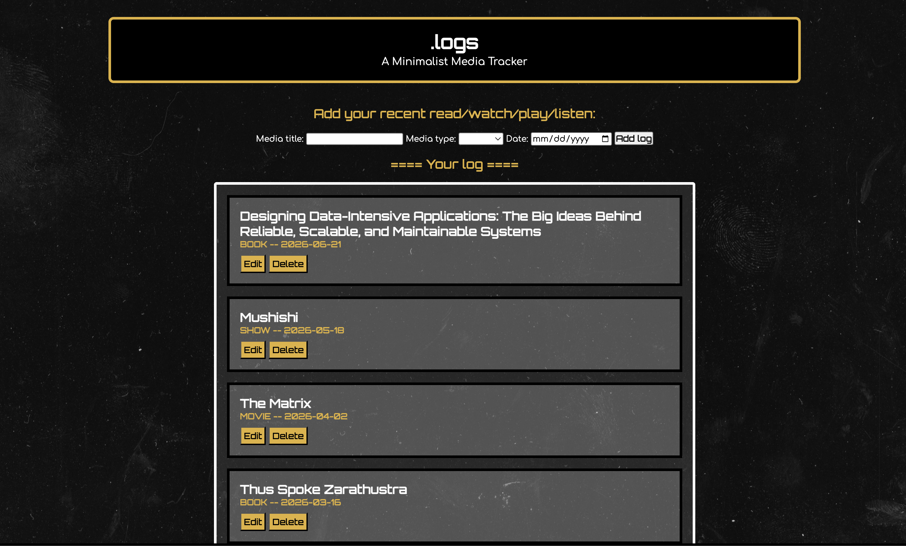

# .logs -- A Media Tracking Web App
A minimal media tracker for users to log when they watch/read/listen to different content. It makes use of the browser's `localStorage` (Web Storage/DOM Storage/HTML5 Storage) to store memory across site refreshes, browsers closing, and even computer restarts. Note that `localStorage` is deleted when clearing recent history & cookies.

